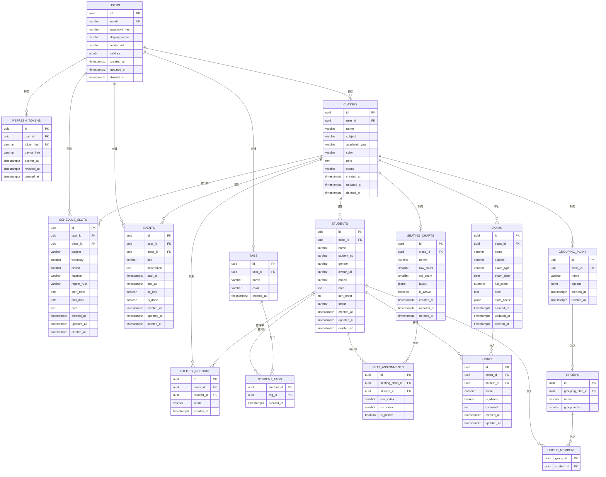

# TeacherDesk 数据库设计（ER 图 + 表结构）

- 数据库：PostgreSQL 15
- 主键：`uuid`（`gen_random_uuid()`，pgcrypto）
- 时间：`timestamptz`，统一存 UTC
- 软删除：`deleted_at IS NULL` 表示有效；所有查询默认带该条件
- 所有业务表通过链路最终归属到 `users.id`（数据隔离边界）

---

## 1. ER 图（Mermaid）



---

## 2. 表结构说明

### 2.1 users — 教师账号
| 列 | 类型 | 约束 | 说明 |
|---|---|---|---|
| id | uuid | PK | |
| email | varchar(255) | UNIQUE, NOT NULL | 登录名，存小写 |
| password_hash | varchar(255) | NOT NULL | bcrypt cost=12 |
| display_name | varchar(64) | NOT NULL | 昵称 |
| avatar_url | varchar(512) | | |
| settings | jsonb | DEFAULT '{}' | 节次配置、等级阈值、是否显示周末等 |
| last_login_at | timestamptz | | |
| created_at / updated_at / deleted_at | timestamptz | | |

`settings` 示例：

```json
{
  "periodsPerDay": 8,
  "showWeekend": false,
  "periodTimes": [["08:00", "08:45"], ["08:55", "09:40"]],
  "gradeThresholds": { "excellent": 0.85, "good": 0.75, "pass": 0.6 }
}
```

---

### 2.2 refresh_tokens — 刷新令牌
| 列 | 类型 | 约束 | 说明 |
|---|---|---|---|
| id | uuid | PK | |
| user_id | uuid | FK→users, ON DELETE CASCADE | |
| token_hash | varchar(64) | UNIQUE, NOT NULL | SHA-256(token)，明文不落库 |
| device_info | varchar(255) | | User-Agent 摘要 |
| expires_at | timestamptz | NOT NULL | |
| revoked_at | timestamptz | | 非空即失效（登出 / rotation） |
| created_at | timestamptz | NOT NULL | |

---

### 2.3 classes — 班级
| 列 | 类型 | 约束 |
|---|---|---|
| id | uuid | PK |
| user_id | uuid | FK→users, NOT NULL |
| name | varchar(64) | NOT NULL |
| subject | varchar(32) | 可空 |
| academic_year | varchar(16) | NOT NULL，如 `2026-2027` |
| color | varchar(16) | 默认 `#3B82F6` |
| note | text | |
| status | varchar(16) | `active` / `archived`，默认 active |

---

### 2.4 students — 学生
| 列 | 类型 | 约束 |
|---|---|---|
| id | uuid | PK |
| class_id | uuid | FK→classes, NOT NULL |
| name | varchar(64) | NOT NULL |
| student_no | varchar(32) | 班级内唯一（部分唯一索引） |
| gender | varchar(8) | `male` / `female` / `other` |
| avatar_url | varchar(512) | |
| phone | varchar(32) | 家长联系方式 |
| note | text | |
| sort_order | int | 默认 0，用于名单排序 |
| status | varchar(16) | `active` / `inactive` |

---

### 2.5 tags / student_tags — 学生标签

- `tags` 归属 user（可跨班复用），`UNIQUE(user_id, name)`。
- `student_tags` 复合主键 `(student_id, tag_id)`，多对多。

---

### 2.6 schedule_slots — 周课表条目
| 列 | 类型 | 说明 |
|---|---|---|
| weekday | smallint | 1 = 周一 … 7 = 周日 |
| period | smallint | 第几节，从 1 起 |
| repeat_rule | varchar(16) | `weekly` / `odd_week` / `even_week` |
| start_date / end_date | date | 学期范围，可空表示不限 |

约束：`UNIQUE(user_id, weekday, period, repeat_rule) WHERE deleted_at IS NULL` —— 同一节次同一重复规则只能排一门课，单双周可各排一门。

---

### 2.7 events — 待办 / 一次性事件

`class_id` 可空（不关联具体班级的私人事项）。用于首页「今日待办」。

---

### 2.8 seating_charts / seat_assignments — 座位图

`seating_charts`
| 列 | 说明 |
|---|---|
| row_count / col_count | 网格尺寸（`rows`/`cols` 是 SQL 保留字，故加后缀） |
| layout | jsonb，标记禁用格、过道与讲台方位 |
| is_active | 当前使用的方案；同一 class 下最多一个 true |

`layout` 示例：

```json
{
  "podium": "top",
  "disabledCells": [[2, 3], [2, 4]],
  "aisles": { "afterCols": [3] }
}
```

`seat_assignments`
| 列 | 说明 |
|---|---|
| seating_chart_id | FK，ON DELETE CASCADE |
| student_id | FK |
| row_index / col_index | 从 0 起 |
| is_pinned | 随机排座时是否固定该学生 |

约束：
- `UNIQUE(seating_chart_id, row_index, col_index)` — 一个座位只能坐一人
- `UNIQUE(seating_chart_id, student_id)` — 一个学生在一套方案里只有一个座位

---

### 2.9 exams / scores — 考试与成绩

`exams`
| 列 | 说明 |
|---|---|
| exam_type | `daily` / `unit` / `midterm` / `final` |
| full_score | numeric(6,2)，默认 100 |
| stats_cache | jsonb，成绩提交后写入的统计快照，读分析页时优先命中 |

`stats_cache` 示例：

```json
{
  "count": 48,
  "absent": 2,
  "avg": 78.4,
  "max": 98,
  "min": 41,
  "median": 80,
  "stddev": 12.3,
  "passRate": 0.875,
  "excellentRate": 0.229,
  "computedAt": "2026-08-30T02:11:00Z"
}
```

`scores`
| 列 | 说明 |
|---|---|
| score | numeric(6,2)，NULL 表示未录入 |
| is_absent | true 时统计中排除该学生 |

约束：`UNIQUE(exam_id, student_id)`；CHECK `score IS NULL OR score >= 0`；应用层再校验 `score <= exam.full_score`。

---

### 2.10 lottery_records — 抽签历史

支撑「不重复模式」「按权重降低重复率」，以及学生详情页的「本学期被抽中 N 次」。保留策略：每班保留最近 1000 条，定期清理。

---

### 2.11 grouping_plans / groups / group_members — 分组方案

`grouping_plans.options` 示例：

```json
{
  "mode": "byGroupCount",
  "groupCount": 6,
  "balanceGender": true,
  "balanceByExamId": "0b1c…",
  "separatePairs": [["stu-a", "stu-b"]]
}
```

`group_members` 复合主键 `(group_id, student_id)`；「同一方案内一个学生只属于一组」由应用层事务保证。

---

## 3. 数据隔离规则

所有业务数据必须能追溯到 `user_id`：

```
users
 ├─ classes.user_id
 │   ├─ students.class_id
 │   │   ├─ student_tags.student_id
 │   │   ├─ scores.student_id
 │   │   └─ seat_assignments.student_id
 │   ├─ seating_charts.class_id
 │   ├─ exams.class_id
 │   ├─ lottery_records.class_id
 │   └─ grouping_plans.class_id
 ├─ schedule_slots.user_id
 ├─ events.user_id
 ├─ tags.user_id
 └─ refresh_tokens.user_id
```

实现建议：ORM 层统一封装 `scopedByUser(userId)` 仓储方法，禁止在 service 中直接裸查业务表。

---

## 4. 关键索引汇总

```sql
CREATE UNIQUE INDEX uq_users_email  ON users (lower(email)) WHERE deleted_at IS NULL;
CREATE INDEX idx_refresh_user       ON refresh_tokens (user_id, revoked_at);
CREATE INDEX idx_classes_user       ON classes (user_id, status) WHERE deleted_at IS NULL;
CREATE INDEX idx_students_class     ON students (class_id, status) WHERE deleted_at IS NULL;
CREATE UNIQUE INDEX uq_students_no  ON students (class_id, student_no)
    WHERE student_no IS NOT NULL AND deleted_at IS NULL;
CREATE INDEX idx_slots_user_day     ON schedule_slots (user_id, weekday) WHERE deleted_at IS NULL;
CREATE INDEX idx_events_user_time   ON events (user_id, start_at) WHERE deleted_at IS NULL;
CREATE UNIQUE INDEX uq_seat_cell    ON seat_assignments (seating_chart_id, row_index, col_index);
CREATE UNIQUE INDEX uq_seat_student ON seat_assignments (seating_chart_id, student_id);
CREATE UNIQUE INDEX uq_chart_active ON seating_charts (class_id) WHERE is_active AND deleted_at IS NULL;
CREATE INDEX idx_exams_class_date   ON exams (class_id, exam_date DESC) WHERE deleted_at IS NULL;
CREATE UNIQUE INDEX uq_score        ON scores (exam_id, student_id);
CREATE INDEX idx_scores_student     ON scores (student_id);
CREATE INDEX idx_lottery_class_time ON lottery_records (class_id, created_at DESC);
```

---

## 5. 统计口径定义（与 PRD 3.7 对齐）

| 指标 | 定义 |
|---|---|
| 参考人数 | `is_absent = false AND score IS NOT NULL` 的记录数 |
| 均分 | 参考学生分数的算术平均 |
| 及格率 | `score >= full_score * 0.6` 占参考人数比例 |
| 优秀率 | `score >= full_score * gradeThresholds.excellent` 占参考人数比例 |
| 标准差 | 总体标准差（分母为 N） |
| 名次 | 同分并列同名次，下一名次跳号（1, 2, 2, 4） |
| Z-score | `(score - avg) / stddev`；stddev = 0 时记为 0 |
| 进退步 | 与该生上一次同科目考试的名次差（正数为进步） |
